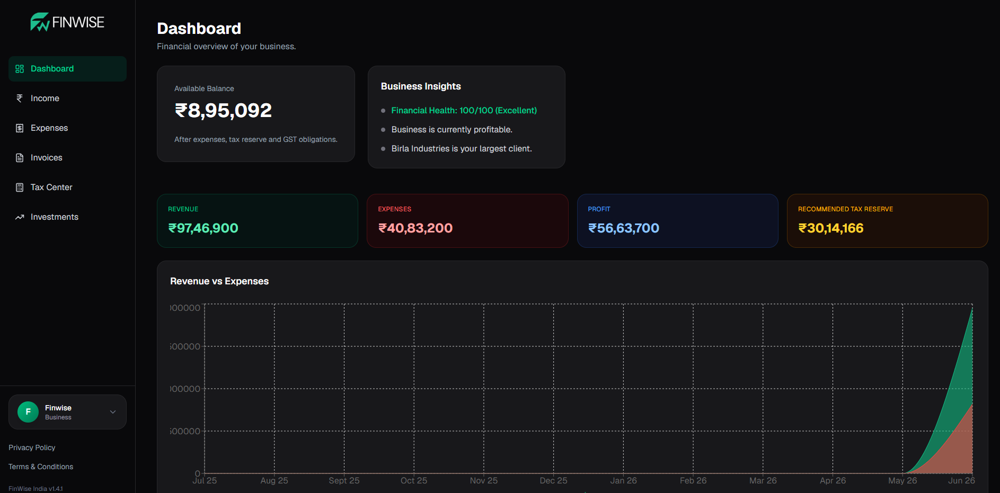

# FinWise India

Smart Finance & Tax Management Platform for Indian Freelancers, Consultants, Agencies & Small Businesses

> **Version:** 1.4.1
>
> **Release Date:** June 24, 2026

---

# What's New in v1.4.1 — Dashboard Revamp

* Redesigned Dashboard with a cleaner and more focused layout
* Added Business Insights section with smart financial recommendations
* Added Upcoming Obligations widget for recurring expenses
* Improved Available Balance section and removed redundant metrics
* Simplified KPI cards for better readability and usability
* Added Financial Health Score insights
* Moved User Profile menu into Sidebar
* Redesigned User Dropdown for light and dark mode compatibility
* Added Logout Confirmation Modal
* Added Recurring Expense Automation System
* Added Auto-Generated Recurring Expense Tracking
* Improved Expense Management workflow and recurring frequency options
* Fixed Dashboard calculation and data consistency issues
* Improved UI/UX consistency across Dashboard, Income, and Expenses modules
* Multiple bug fixes, performance improvements, and TypeScript fixes

---

# Dashboard Preview



---

# About

FinWise India is a modern finance management platform built specifically for Indian freelancers, consultants, creators, agencies, and small businesses.

The platform helps users:

* Track Income
* Monitor Expenses
* Analyze Cash Flow
* Manage Invoices
* Track Investments
* Understand Business Performance
* Estimate Taxes & GST

---

# Features

## Dashboard

* Financial Overview
* Revenue Tracking
* Expense Analytics
* Available Balance Monitoring
* Financial Health Score
* Business Insights
* Upcoming Obligations
* Monthly Performance Summary

## Income Tracking

* Add Income Sources
* Revenue History
* Income Analytics
* Monthly Revenue Tracking

## Expense Management

* Track Expenses
* Categorize Spending
* Expense Reports
* Recurring Expenses
* Automated Recurring Expense Generation

## Invoice Tracker

* Create Invoices
* Manage Client Records
* Track Invoice Status
* Payment Monitoring

## Tax Center

* Tax Estimation
* GST Support
* Tax Planning

## Settings

* Profile Management
* Business Information
* Tax Preferences
* Account Settings

---

# Tech Stack

## Frontend

* Next.js
* React
* TypeScript
* Tailwind CSS
* ShadCN UI

## Backend

* Supabase
* PostgreSQL

## Authentication

* Supabase Auth
* Google Login

## Data Visualization

* Recharts

---

# Getting Started

## Clone Repository

```bash
git clone https://github.com/kartikbansode/finwise.git
```

## Install Dependencies

```bash
npm install
```

## Create Environment File

Create:

```env
.env.local
```

Add:

```env
NEXT_PUBLIC_SUPABASE_URL=YOUR_SUPABASE_URL
NEXT_PUBLIC_SUPABASE_ANON_KEY=YOUR_SUPABASE_ANON_KEY
SUPABASE_SERVICE_ROLE_KEY=YOUR_SUPABASE_SERVICE_ROLE_KEY
```

## Run Development Server

```bash
npm run dev
```

Open:

```text
http://localhost:3000
```

---

# Project Roadmap

### Current Modules

* Dashboard
* Income Tracking
* Expense Management
* Invoice Tracker
* Tax Center
* Settings

### Planned Features

* Advanced Financial Reports
* Client Portal
* Invoice PDF Export
* GST Return Assistance
* Profit & Loss Statements
* Cash Flow Forecasting
* Multi-Business Support
* AI-Powered Financial Insights

---

# Copyright & Usage Notice

> Copyright © 2026 Kartik Bansode.
>
> All Rights Reserved.

This repository contains proprietary software.

You may **NOT**:

* Copy this project
* Reuse the source code
* Redistribute the project
* Sell the project
* Use the project commercially
* Create derivative works

without explicit written permission from the author.

Unauthorized use, reproduction, or distribution is strictly prohibited.

---

# Contact

**Kartik Bansode**

GitHub: https://github.com/kartikbansode

Email: [bansodekartik00@gmail.com](mailto:bansodekartik00@gmail.com)

Repository: https://github.com/kartikbansode/finwise

For licensing, collaboration, or business inquiries, please contact the author.

---

# Disclaimer

FinWise India is intended for financial management and educational purposes only.

This software does not provide legal, tax, accounting, or investment advice.

Users should consult qualified professionals before making important financial, tax, legal, accounting, or investment decisions.

---

# Built With

* Next.js
* React
* TypeScript
* Tailwind CSS
* Supabase
* PostgreSQL
* Recharts

---

# Development Status

> **FinWise India is currently under active development.**

This project is in its early stages and features may change, improve, or be replaced in future releases.

## Important Notice

While every effort has been made to ensure accuracy, FinWise India may:

* Contain bugs or unexpected behavior
* Produce incorrect financial calculations
* Produce incorrect tax estimates
* Produce inaccurate GST calculations
* Contain incomplete features
* Generate incorrect financial insights

Users should **not rely solely on this software** for making important financial, tax, legal, accounting, or investment decisions.

Always verify calculations independently and consult a qualified Chartered Accountant (CA), tax professional, accountant, or financial advisor before taking any action based on information provided by this application.

The author shall not be held responsible for any financial loss, tax liability, penalties, damages, or consequences resulting from the use of this software.

Thank you for using FinWise India and helping improve the platform through feedback and testing.
